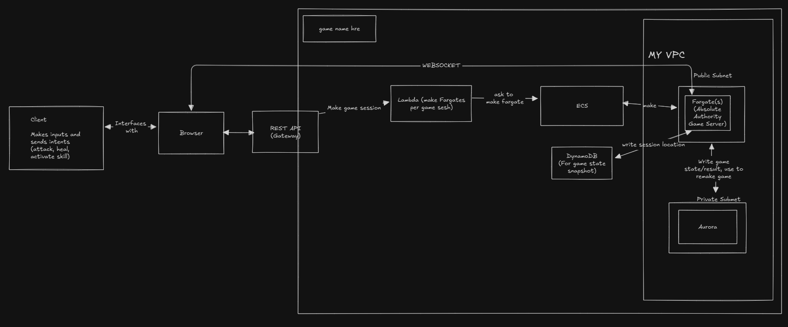

# The Game

Currently a work in progress. I'm hoping to draw some avatars and add more features like items, rewards on victory, procedurally generated choice-based maps. STS is my template, pretty much.

(OUTDATED) - Why use a fargate for every game session?

## Write Up

It's live on www.wraityapp.net !

I bought a domain off Cloudflare (arbitrarily) and had it proxy to my S3 bucket containing the frontend. 

Then the backend itself is hosted on an EC2 who only accepts incoming traffic from Cloudflare Ips. I do not anticipate any visitors to the website besides people I invite to play with me, but if I were to consider hundreds of thousands of players I would have an auto scaling group with EC2s who all publish the new state to the room key/topic that the players subscribe to.

The backend is composed of two parts:
- The game engine/logic
- The server logic containing a web socket server and logic for creating rooms.

### Game Components

### Game Loop
- I had STS2 in mind when making this game. So, the player will always go first when beginning an encounter, followed by the enemy, and then back again until one side dies. 

#### Players, Enemies, Entities
- All players/enemies are based on the Actor typing. The Actor typing contains stuff like the id, team, the combined stats of the team, statuses, buffs, current deck, etc. Where Players and EnemyPlayers differ is that players have to manage their AP and currency, while enemies just have to also show their intent.
- Actor contains a team of Entities. Entities are the characters whom players and enemies control. They have their own stats and dedicated starter decks. Players have the combined health and defense/magic defense of each entity in their team, but when using an attack card, the attack scales off any (de)buffs and the entity's attack/magic attack
- When it comes to multiple players, when an enemy attacks, all players are hit.

### Game Engine
- Every action taken is processed in an Action typing. For exaple when a player plays a card, a playCard action is sent to the server to verify the validity of the action, followed by the processing of that card's effects, returning the state afterward which is emitted to all players.
